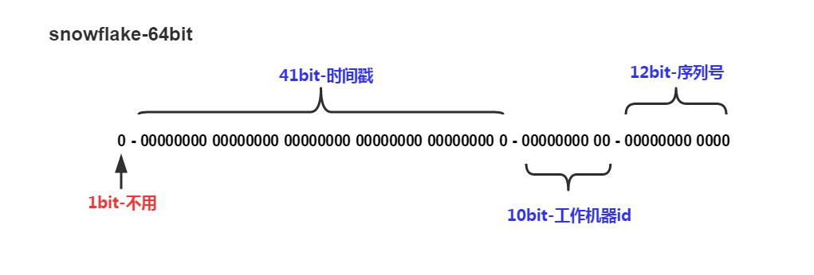

# snowflake

## snowflake 起因

据说是 Twitter 将存储系统从 MySQL 迁移到 Cassandra 的过程中，由于 Cassandra 没有顺序 ID 生成机制，于是他们自己开发了一套可以全局生成唯一 ID 的服务，起名叫做 `Snowflake`。

## snowflake 名字

`snowflake` 雪花的形状能惟妙惟肖的将算法的思想展示出来，它看上去像是沿着主干（时间戳），如果有重复，那么分叉分出机器id，如果仍有重复，再分叉，分出序列号。

该图片由 `Clker-Free-Vector-Image` 在 `Pixabay` 上发布

## snowflake 算法

- 算法
  snowflake 是 Twitter 开源的分布式 ID 生成算法，输出结果是一个 long 型的 ID。
- 核心思想
  - 41 位的时间序列作为毫秒数（精确到毫秒，41 位的长度可以使用69年）
  - 10 位的机器标识（`5 个 bit 是数据中心，5 个 bit 的机器 ID`共 10 位 的长度最多支持部署 1024 个节点）
  - 12 位的计数顺序号|流水号（12 位的计数顺序号支持每个节点每毫秒产生 4096 个ID序号）最高位是符号位，始终为 0。
  

  
  

- 优点
  高性能、低延迟、独立的应用（依赖少，实现简单）、按时间有序
- 缺点
  依赖机器时间，若有回拨会导致生成 id 重复；id 并不是严格递增的，而是趋势递增的

## 使用场景
- 唯一一条消息
- 唯一一笔交易
- 唯一一个用户
- 唯一一张图片
- ...

## Java 实现版本
@regan-xu

## Python 实现版本
@luky1833

## 贡献
欢迎任何形式的贡献，感谢这些杰出的贡献者！
 
